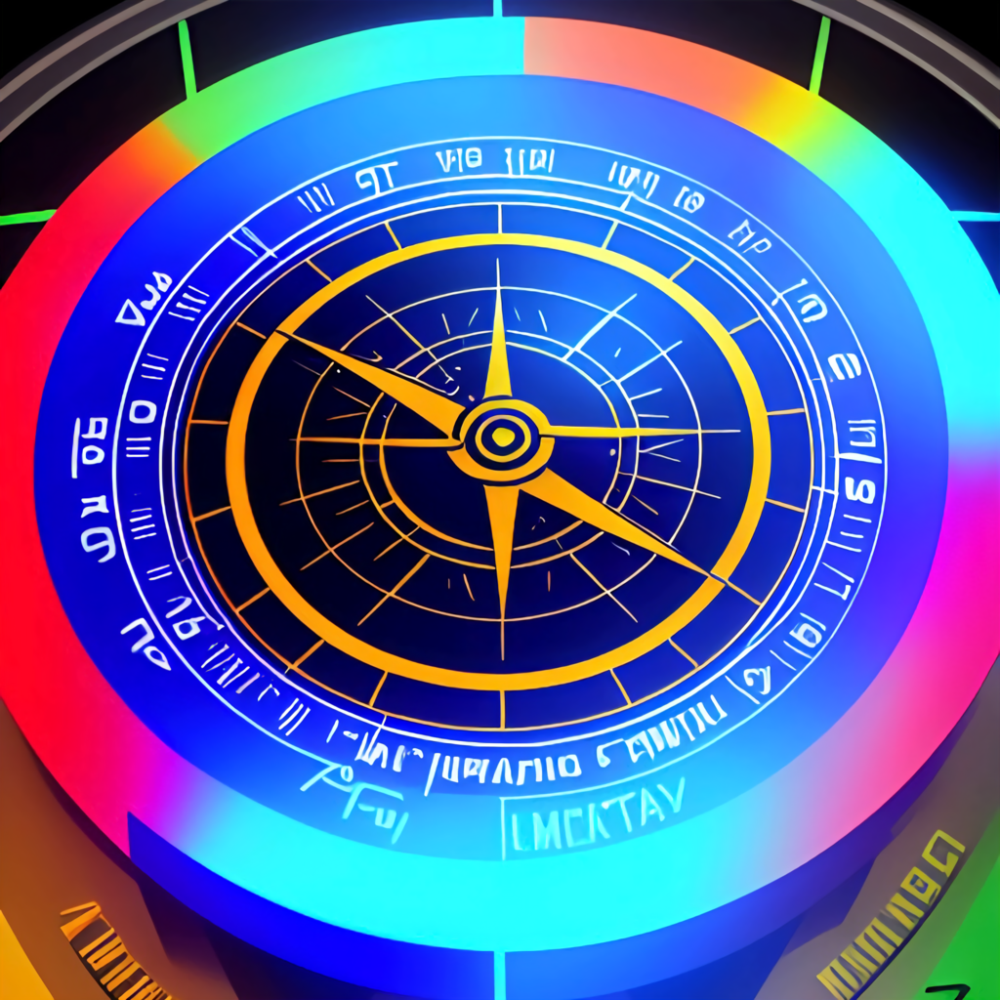

# BubbleApp
 A Clinometer app written in SwiftUI. Uses the CoreMotion framework to calculate device motion.
 
# Installing
 You can compile yourself or download the .IPA from the releases tab. Install the .IPA with any tool like AltStore or TrollStore.
 
 # Thanks to
 https://developer.apple.com/tutorials/
